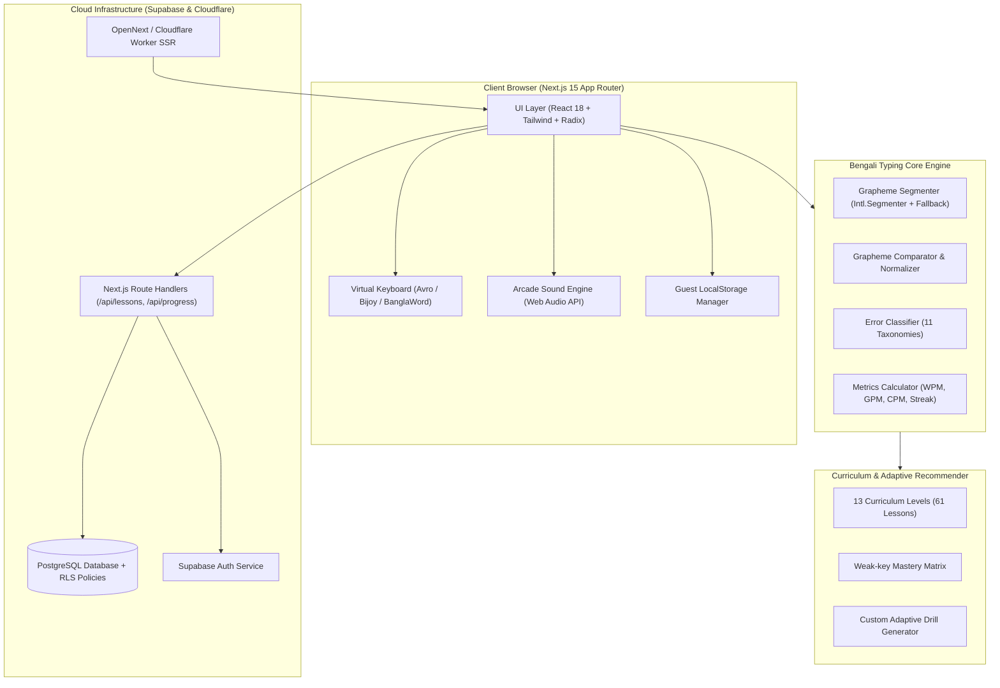
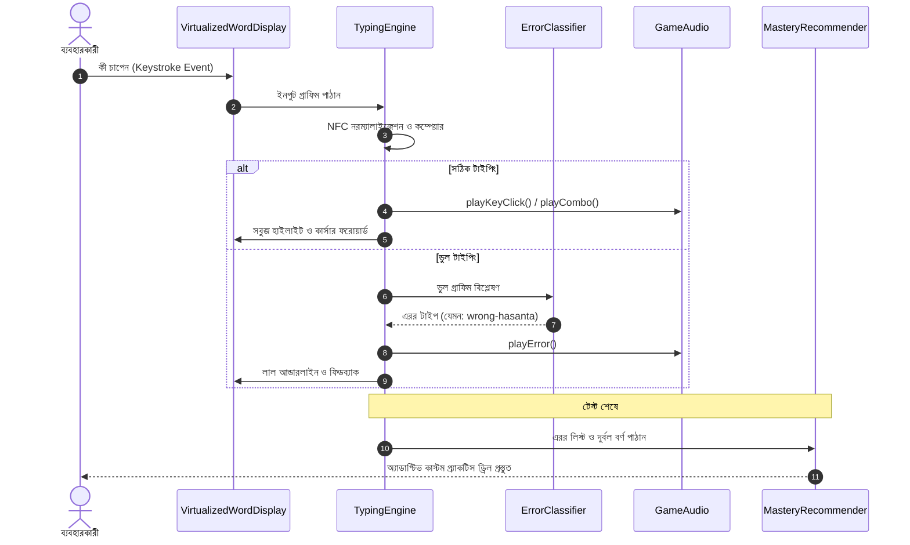

# 🏛️ সিস্টেম আর্কিটেকচার ও টেকনিক্যাল ডিজাইন (System Architecture)

বাংলা টাইピング মাস্টার একটি উচ্চ-পারফরম্যান্সসম্পন্ন, পূর্ণাঙ্গ বাংলা টাইপিং শেখা ও স্পিড টেস্ট প্ল্যাটফর্ম। এটি ক্লায়েন্ট-সাইড পারফরম্যান্স, অফলাইন রেজিলিয়েন্স এবং জটিল বাংলা বর্ণবিন্যাস নির্ভুলভাবে প্রসেস করার জন্য তৈরি।

---

## 📑 সূচিপত্র (Table of Contents)
1. [উচ্চস্তরের আর্কিটেকচার ডায়াগ্রাম](#১-উচ্চস্তরের-আর্কিটেকচার-ডায়াগ্রাম)
2. [কোর সাবসিস্টেমস (Core Subsystems)](#২-কোর-সাবসিস্টেমস-core-subsystems)
3. [বাংলা টাইপিং ইঞ্জিন ডাটা ফ্লো](#৩-বাংলা-টাইপিং-ইঞ্জিন-ডাটা-ফ্লো)
4. [স্টোরেজ ও পারসিস্টেন্স মডেল](#৪-স্টোরেজ-ও-পারসিস্টেন্স-মডেল)
5. [ওয়েব অডিও সিন্থেসাইজার](#৫-ওয়েব-অডিও-সিন্থেসাইজার)

---

## ১. উচ্চস্তরের আর্কিটেকচার ডায়াগ্রাম

---

## ২. কোর সাবসিস্টেমস (Core Subsystems)

### ক. বাংলা গ্রাফিম ও নরম্যালাইজার ইঞ্জিন (`src/lib/bengali-grapheme.ts`, `comparator.ts`)
- **সমস্যা:** বাংলা ভাষায় একটি বর্ণে একাধিক ইউনিকোড কোডপয়েন্ট থাকতে পারে (যেমন: হসন্ত, কার-চিহ্ন, র-ফলা, য-ফলা)। সাধারণ স্ট্রিং বা স্লাইস করলে বর্ণ ভেঙে যায়।
- **সমাধান:** আমাদের ইঞ্জিন ব্রাউজারের নেটিভ `Intl.Segmenter` ব্যবহার করে এবং পুরনো ব্রাউজারের জন্য একটি ডেডিকেটেড রিগ্রেশন-প্রুফ ফলব্যাক মডিউল ধারণ করে। সমস্ত ইনপুট ও রেফারেন্স টেক্সট তুলনা করার পূর্বে `NFC` (Normalization Form C) ফরম্যাটে রূপান্তরিত হয়।

### খ. মাল্টি-লেআউট ভার্চুয়াল কীবোর্ড (`src/lib/keyboard-layouts.ts`, `VirtualKeyboard.tsx`)
প্ল্যাটফর্মটি ৩টি জনপ্রিয় বাংলা লেআউট সাপোর্ট করে:
1. **Avro Phonetic:** ধ্বনিভিত্তিক কি-ম্যাপিং (`k` -> `ক`, `kh` -> `খ`)।
2. **Bijoy Classic / Bayanno:** সরকারি দপ্তর ও প্রিন্টিং ইন্ডাস্ট্রির মানদণ্ড (যেমন: `j` -> `ক`, Shift+`j` -> `খ`)।
3. **BanglaWord:** লিগ্যাসি ডকুমেন্ট টাইপিং লেআউট।
ভার্চুয়াল কীবোর্ডটি প্রতিটি অক্ষরের জন্য সঠিক আঙুল নির্দেশিকা (Finger Guidance) ও কালার-কোডেড জোন প্রদর্শন করে।

### গ. টাইপিং মেট্রিক্স ও ত্রুটি শ্রেণিবিভাগ (`metrics.ts`, `error-classifier.ts`)
- **GPM (Graphemes Per Minute):** বাংলা টাইপিংয়ের সবচেয়ে নির্ভরযোগ্য মানদণ্ড।
- **Net WPM:** আন্তর্জাতিক প্রমিত সূত্র: $(\text{Keystrokes} / 5) - (\text{Uncorrected Errors} / \text{Minutes})$।
- **রিয়েলটাইম এরর ট্যাক্সোনমি:** ১১টি ভিন্ন ক্যাটাগরিতে ত্রুটি চিহ্নিতকরণ (`wrong-hasanta`, `wrong-kar`, `wrong-conjunct`, `wrong-order`, `space-error` ইত্যাদি)।

---

## ৩. বাংলা টাইপিং ইঞ্জিন ডাটা ফ্লো

---

## ৪. স্টোরেজ ও পারসিস্টেন্স মডেল

প্ল্যাটফর্মটি **জিরো-ফ্রাস্ট্রেশন অনবোর্ডিং** অনুসরণ করে:
1. **গেস্ট মোড (Guest Mode):** কোনো অ্যাকাউন্ট ছাড়াই শিক্ষার্থী সমস্ত লেসন, গেম ও স্পিড টেস্ট সম্পূর্ণ করতে পারে। তার অগ্রগতি ব্রাউজারের `localStorage`-এ নিরাপদে সংরক্ষিত থাকে।
2. **রেজিস্টার্ড ইউজার (Synced Mode):** সাইন-ইন করলে Supabase PostgreSQL-এ ডাটা স্বয়ংক্রিয়ভাবে সিঙ্ক হয়।
3. **সিকিউরিটি (Row Level Security):** `002_rls_policies.sql` মাইগ্রেশনের মাধ্যমে প্রতিটি শিক্ষার্থীর ডাটা রো-লেভেল সিকিউরিটি দ্বারা সম্পূর্ণ সুরক্ষিত রাখা হয়।

---

## ৫. ওয়েব অডিও সিন্থেসাইজার (`src/lib/game/game-audio.ts`)

- কোনো এক্সটার্নাল MP3 বা অডিও ফাইল লোড করার প্রয়োজন হয় না।
- বিশুদ্ধ **Web Audio API** ব্যবহার করে ব্রাউজারের নিজস্ব অডিও কনটেক্সট থেকে সাইন ও সটুথ ওয়েভ জেনারেট করা হয়।
- ফলে কোনো নেটওয়ার্ক ল্যাটেন্সি থাকে না এবং লো-এন্ড ডিভাইসেও নিমেষে সাউন্ড প্লে হয়।
